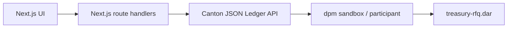
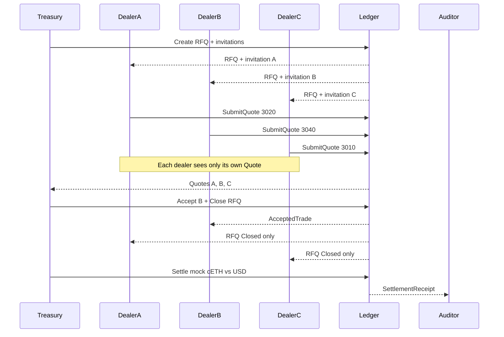
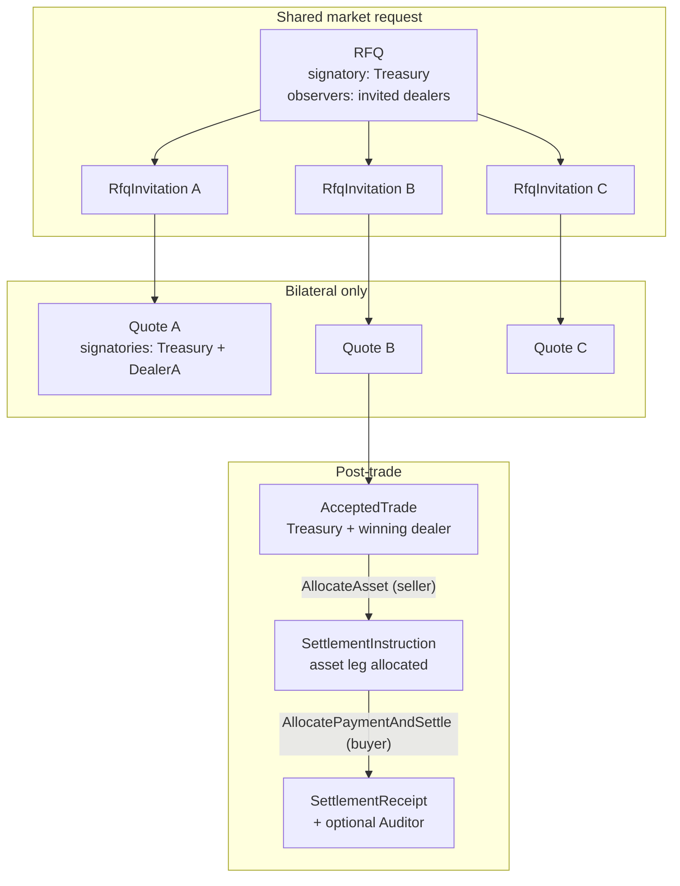

# Private Treasury RFQ

HackCanton Season 3 app: a corporate treasury requests quotes from multiple dealers on Canton, while each dealer sees only its own price.

## What an RFQ is

**RFQ** means Request for Quote. A buyer or seller publishes a trade they want done — asset, side (buy or sell), and size — and asks selected dealers to bid. Each dealer replies with a private price. The requester compares the quotes, picks one, and that pair settles. Competitors never see each other’s prices.

This is how corporate treasuries and institutional OTC desks trade. It is not an exchange order book and not an AMM.

Example demo flow:

1. Treasury posts **Sell 10 cETH**
2. Dealer A quotes `$3,020`, Dealer B `$3,040`, Dealer C `$3,010`
3. Treasury sees all three and accepts B (best bid on a sell)
4. Dealer A still cannot see B’s or C’s price
5. Treasury and Dealer B settle; an optional auditor sees only the final receipt

## Why Canton

On a public chain, every dealer quote is visible. On Canton, the treasury coordinates one RFQ while each quote is a **bilateral contract**.

> Canton lets multiple institutions coordinate on the same transaction workflow while each party sees only the data it is entitled to see.

Privacy comes from Daml signatories and observers on the ledger — not from filtering in the frontend.

## High-level architecture

Keep the stack thin. The ledger is the source of truth for RFQ, quote, trade, and settlement state.



| Layer | Role |
| --- | --- |
| Frontend | Role switcher (demo login), treasury / dealer / audit views |
| App API | Thin command/query proxy; acts as the selected party |
| Canton | Validates authorization and distributes contract data need-to-know |
| Daml DAR | RFQ lifecycle, bilateral quotes, settle, audit receipt |

No Kafka, Redis, PQS, or Kubernetes in the hackathon MVP.

## Workflow



## Contract model

Seven templates. The important split: the **RFQ is shared**; each **Quote is bilateral**.



### Templates

| Template | Signatory | Observers | Choices | Purpose |
| --- | --- | --- | --- | --- |
| `RFQ` | treasury | invited dealers | `Close`, `Cancel` — both argument-free | Shared market request (no prices) |
| `RfqInvitation` | treasury | that dealer only | `SubmitQuote`, `Decline` | Privacy-preserving factory for `SubmitQuote` |
| `Quote` | treasury + dealer | none | `Accept`, `Revise`, `Withdraw` | Private bilateral price |
| `AcceptedTrade` | treasury + dealer | none | `AllocateAsset` | Binding accepted terms |
| `TokenHolding` | issuer | owner | `Transfer` | Mock CIP-56-shaped holding (`cETH` / `USD` / `CBTC`) |
| `SettlementInstruction` | treasury + dealer | none | `AllocatePaymentAndSettle`, `CancelAllocation` | Half-settled DvP: asset leg allocated, cash leg outstanding |
| `SettlementReceipt` | treasury + dealer | optional auditor | — | Immutable post-trade evidence |

Templates are correlated by an `rfqId : Text`, never by `ContractId`. `Close` archives and
recreates the RFQ to change its status, which would invalidate any stored contract id.
Contract keys are deliberately not used: key maintainers leak existence information.

### Privacy-critical design rules

Do **not** put `SubmitQuote` or `Accept` on the shared `RFQ`. All invited dealers observe the RFQ. Choice arguments and nested consequences on that contract are visible to every observer ([Canton privacy model](https://docs.canton.network/appdev/deep-dives/privacy-model)).

- A price on `RFQ.SubmitQuote` would leak to competitors
- Fetching a `Quote` inside `RFQ.Accept` would **divulge** the winning quote to losing dealers
- Close the RFQ as a **sibling command** in the same submission as Accept
- Never pass price, dealer, or quote id into `Close` — it takes no arguments at all
- Correlate contracts by `rfqId`, never by `ContractId`, because `Close` recreates the RFQ
- `asset` and `quoteCurrency` are `Text`, not cETH-only enums, so CBTC can be added later without new templates

## Privacy model

| Party | Sees |
| --- | --- |
| Treasury | All RFQs, invitations, quotes, accepted trade, receipt |
| Dealer A (loser) | RFQ + own invitation + own quote; after close, closed RFQ only |
| Dealer B (winner) | RFQ + own quote + `AcceptedTrade` + receipt |
| Auditor | `SettlementReceipt` only — not competing pre-trade quotes |
| Stranger | Nothing |

Frontend renders whatever ACS the acting party can query. Competitor quotes must not be hidden only in the UI.

## Settlement

Happy path: **SELL 10 cETH**. The treasury delivers cETH; the dealer pays `price * quantity`
USD. Both legs move in a single transaction, so neither side can take delivery without paying.

Settlement is **two-step delivery-versus-payment**, not one `Settle` choice:

```
AcceptedTrade --AllocateAsset (controller: seller)--> SettlementInstruction
SettlementInstruction --AllocatePaymentAndSettle (controller: buyer)--> SettlementReceipt
```

A single `Settle` choice is not implementable. It would have to take the counterparty's
holding `ContractId` as an argument, and neither party is a stakeholder on the other's
holding, so neither can know that id. Each side must therefore allocate its own leg. Both
parties sign the instruction, so the second step carries enough authority to move **both**
holdings atomically. `CancelAllocation` lets the seller withdraw if the buyer never pays.

`TokenHolding` lives alone in `Holding.daml` and references no RFQ or trade template, so a
later CIP-56 adapter (live [CBTC](https://docs.bitsafe.finance/developers/instrument-id-management)
or [cETH](https://www.ceth.network/)) replaces that one module without touching the workflow.
Both assets are CIP-56; they differ by registry, not by workflow. Live token integration is
optional (P2).

> **Known limitation.** The allocated asset is pinned by `ContractId`, not escrowed. The mock
> `TokenHolding` has no lock primitive, so a seller can spend the holding after allocating it;
> settlement then fails with contract-not-found and the whole transaction aborts. Nothing is
> lost and no partial settlement is possible, but the seller holds an option to walk away
> between the two steps. Real CIP-56 registries provide a lock, and that is where the fix
> belongs — building an escrow party into the mock would misrepresent whose responsibility
> this is.

## Track alignment

| Track | How this project maps |
| --- | --- |
| Financial Applications | Quote formation, economic choice (best bid/offer), asset flow, accept, settle |
| RWA & Business Workflows | Create RFQ → receive quotes → update state → accept → settle → audit receipt |

## Status

Implemented and verified end to end on Canton SDK **3.5.1**.

| Layer | State |
| --- | --- |
| Contract model | 8 templates, 11 business choices. Builds clean. |
| Test suite | **56 Daml Script tests, all passing. 100% coverage: 8/8 templates, 19/19 choices** (incl. implicit `Archive`). |
| Frontend | Next.js 15 App Router, 11 routes, zero runtime deps beyond React. `tsc` and `next lint` clean. |
| Live ledger | Full round trip driven through the UI against a running sandbox: quote, accept, allocate, settle. |

The privacy claims are **tested, not asserted**. The suite's centrepiece is a set of
negative assertions — proving from each party's own ACS what it *cannot* see:

- a losing dealer's end-state ACS is exactly `{closed RFQ, own quote, own cash}`
- the auditor's entire ACS is settlement receipts — no RFQ, no quote, no trade
- an allocated but uninvited party sees the empty set for all 8 templates
- `RfqFill` is invisible to every party but the treasury, asserted in the very
  transaction that creates it alongside contracts the dealers *do* witness

The same invariant was re-proven against a live participant with **wildcard** ACS
queries (no template filter, so nothing can be hidden by the query shape):

```
DEALER A  filtersByParty = { "DealerA::…": WILDCARD }
  Quote  price 3020.0000000000   RFQ  status Closed
  ABSENT: RfqFill, AcceptedTrade, SettlementInstruction, SettlementReceipt
  -> the winning 3040 and the competing 3010 appear nowhere in the response

AUDITOR   filtersByParty = { "Auditor::…": WILDCARD }
  SettlementReceipt  paymentAmount 30400.0000000000
  ABSENT: RFQ, RfqInvitation, Quote, RfqFill, AcceptedTrade, SettlementInstruction, TokenHolding
```

Settled positions move exactly: treasury 25 -> 15 cETH and +30,400.00 USD; the winning
dealer 0 -> 10 cETH and 1,000,000 -> 969,600.00 USD. Losing dealers are untouched.

### Known gaps

- **`RFQ.Cancel` does not archive the fill right.** An unspent `RfqFill` outlives a
  cancelled auction. Harmless -- it can only be spent against a `Quote` carrying the same
  `rfqId`, and `Cancel` does not archive quotes either -- but the treasury should retire it.
  Cleaning it up automatically would mean passing the fill id into a choice that every
  invited dealer observes, which is the leak this design exists to avoid.
- The allocated asset is pinned, not escrowed (see **Settlement**).
- `TokenHolding` is a mock. Live CIP-56 integration is P2.

## Layout

```
daml/daml/TreasuryRfq/
  Types.daml        Side, RfqStatus, buyerOf/sellerOf, paymentFor, time assertions
  Rfq.daml          RFQ
  Quoting.daml      RfqInvitation + Quote      (mutually recursive: SubmitQuote returns a
                                                Quote, Withdraw returns an invitation, and
                                                Daml has no forward declarations)
  Holding.daml      TokenHolding               (the CIP-56 replacement seam)
  Settlement.daml   AcceptedTrade + SettlementInstruction + SettlementReceipt
```

Module dependency graph is acyclic: `Types -> Holding -> Settlement -> Quoting`, plus
`Types -> Rfq`.

- `daml/` — ledger contracts (`treasury-rfq`)
- `daml-test/` — Daml Script tests (`treasury-rfq-tests`)
- `frontend/` — Next.js 15 app (App Router, TypeScript, Tailwind v4)

## Build

Requires [dpm](https://docs.canton.network/sdks-tools/cli-tools/dpm) and JDK 17+.

```bash
curl https://get.digitalasset.com/install/install.sh | sh
export PATH="$HOME/.dpm/bin:$PATH"    # the installer does not do this for you
dpm install 3.5.1                     # the installer pulls the latest SDK; this repo pins 3.5.1

dpm build --all
dpm test --package-root daml-test
```

Without the explicit `dpm install 3.5.1`, `dpm build` fails with
`target dpm-sdk version not installed` and does not say which version it wanted.

### Running the app

```bash
dpm sandbox                           # gRPC 6865, JSON Ledger API 6864
cd frontend && npm install && npm run dev
```

The frontend defaults to an in-memory fixture so it runs with no sandbox. See
`frontend/README.md` for pointing it at a live ledger.

## Demo script (target, under 3 minutes)

Once choices and UI land:

1. Split view: Treasury sees three quotes; Dealer A sees only `$3,020`
2. Treasury accepts Dealer B (`$3,040`, best bid)
3. Dealer A: RFQ closed, still no winning price
4. Dealer B: accepted trade visible
5. Settle mock cETH vs USD; Auditor sees receipt only
