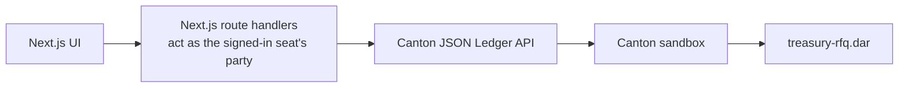
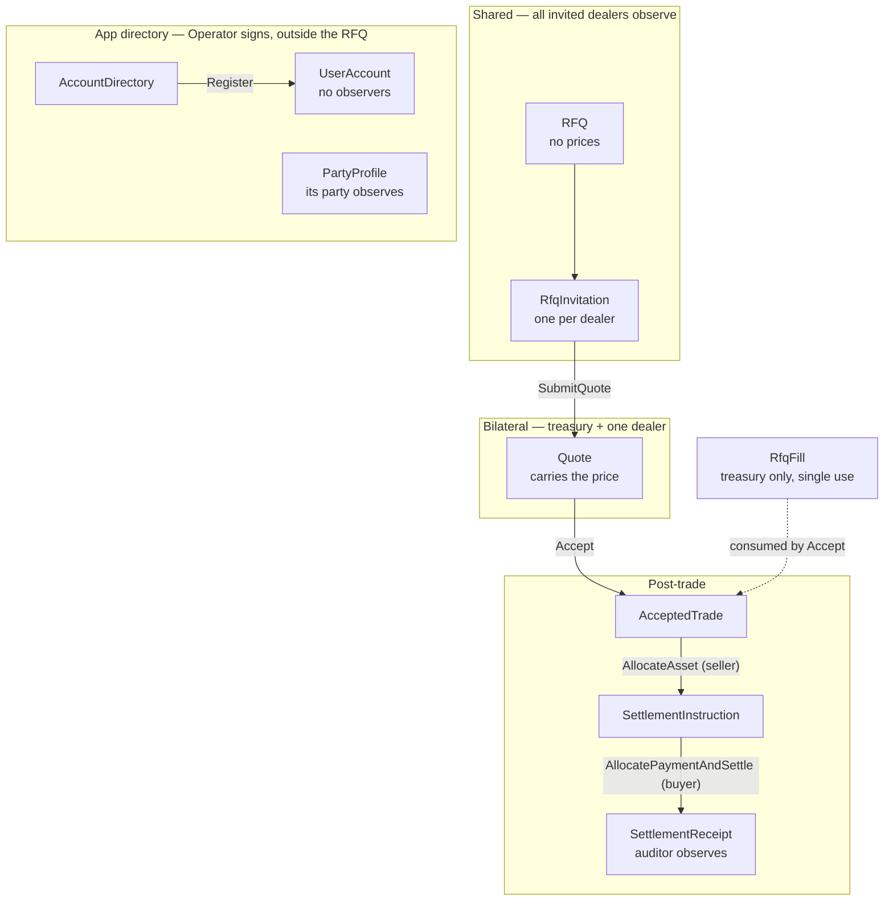
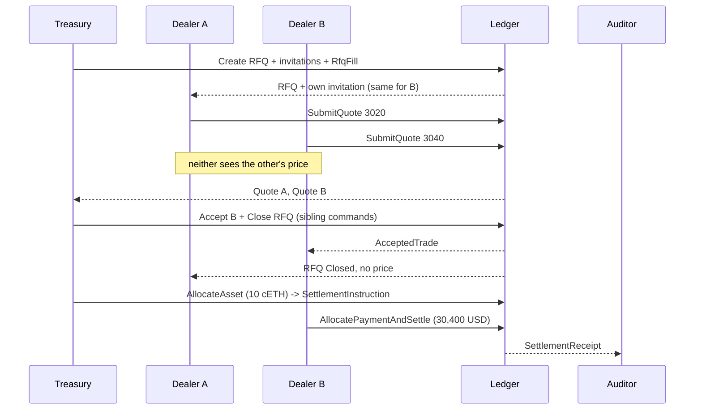

# Private Treasury RFQ

A corporate treasury requests quotes from several dealers on Canton. Each dealer sees only its own price — enforced by the ledger, not the UI.

## What an RFQ is

RFQ means Request for Quote. A treasury publishes the trade it wants done — asset, side, size — invites selected dealers to price it privately, compares the quotes, picks one, and that pair settles. Demo scenario: the treasury sells 10 cETH for USD. Dealer A quotes 3020, Dealer B 3040, Dealer C 3010. Best bid on a sell is B, so the treasury takes 3040 (30,400.00 USD). A and C learn the RFQ closed and nothing else — not the winner, not the winning price.

## Why Canton

On a public chain every quote is visible to every competitor. Here the RFQ is one shared contract, but each quote is a bilateral contract signed only by the treasury and that dealer. Privacy comes from Daml signatories and observers, so a competitor's price is not in the data the ledger will serve you — there is nothing for the frontend to hide.

## Quickstart

```bash
git clone <repo> && cd hackcanton-season-3-treasury-sell
docker compose up               # builds the DAR, starts a Canton sandbox, seeds the demo, serves the UI
                                # -d detached; logs -f; down (-v wipes ledger state)
docker compose run --rm tests   # the 74-script Daml suite
```

| URL / port | What |
| --- | --- |
| http://localhost:3000 | the app, wired to the live ledger |
| localhost:6864 | Canton JSON Ledger API v2 |
| localhost:6865 | Canton gRPC Ledger API |

**Public Try URL (Cloudflare Tunnel).** Target hostname: `https://rfq-app.z12z.org`. Ledger ports stay on loopback; only the UI is published. Copy `env/tunnel.example` → `env/tunnel.local`, set `TUNNEL_TOKEN` / `SESSION_SECRET`, point the dashboard published route at hostname `rfq-app.z12z.org` → service `http://frontend:3000` (never `canton:6864`), then:

```bash
set -a && source env/tunnel.local && set +a
docker compose --profile tunnel up
```

**Sign in.** Every page needs a login. Demo accounts, password = username:
`treasury`, `dealer-a`, `dealer-b`, `dealer-c`, `auditor`. Each lands on its own
desk and cannot open another. `/signup` creates more, bound to an existing seat.
Accounts and trades live on the ledger, so they survive restarts; a volume
seeded before accounts existed needs `docker compose down -v` once.

**Try the happy path.** From the home page, follow
[`docs/HAPPY-PATH.md`](docs/HAPPY-PATH.md) — split view or desk-by-desk accept
→ allocate → settle, plus the privacy checks.

<details>
<summary>Native path (no Docker)</summary>

JDK 17+, Node 24. Without the explicit `dpm install 3.5.1`, `dpm build` fails with `target dpm-sdk version not installed`.

```bash
curl https://get.digitalasset.com/install/install.sh | sh
export PATH="$HOME/.dpm/bin:$PATH"   # the installer does not do this for you
dpm install 3.5.1                    # installer pulls latest; this repo pins 3.5.1
dpm build --all && dpm test --package-root daml-test
dpm sandbox                          # terminal 1; then, in terminal 2:
dpm script --dar daml-test/.daml/dist/treasury-rfq-tests-0.0.1.dar \
  --script-name Demo.Bootstrap:bootstrap \
  --ledger-host 127.0.0.1 --ledger-port 6865 --upload-dar true -w
cd frontend && npm install && npm run dev   # the live ledger is the default
```

With no sandbox at all, `NEXT_PUBLIC_LEDGER=mock npm run dev` serves an in-memory fixture with the same demo accounts.
</details>

## Architecture



## Contract model



| Template | Signatory | Observers | Purpose |
| --- | --- | --- | --- |
| `RFQ` | treasury | invited dealers | Shared market request. `Close`/`Cancel` take no arguments, and are submitted with the fill right archived as a sibling command. |
| `RfqFill` | treasury | none | Single-use right to fill. Stops a double fill without leaking. |
| `RfqInvitation` | treasury | that dealer | Private factory for `SubmitQuote`. |
| `Quote` | treasury + dealer | none | The price. Bilateral. `Accept`, `Revise`, `Withdraw`. |
| `AcceptedTrade` | treasury + dealer | none | Binding terms. `AllocateAsset`. |
| `TokenHolding` | issuer | owner | Mock CIP-56-shaped holding (cETH / USD / CBTC). |
| `SettlementInstruction` | treasury + dealer | none | Half-settled DvP: asset leg allocated, cash leg outstanding. |
| `SettlementReceipt` | treasury + dealer | optional auditor | Immutable post-trade evidence. |
| `PartyProfile` | operator | the party it describes | On-ledger party directory: seat, label, institution. |
| `AccountDirectory` | operator | none | Taken usernames. Consuming `Register` makes uniqueness a contention check, since Canton 3.5.1 does not enforce keys. |
| `UserAccount` | operator | none | Login: username, scrypt hash, bound seat. The hash reaches nobody, not even the bound party. |

## Privacy model

| Party | Sees |
| --- | --- |
| Treasury | Everything: RFQ, all invitations, all quotes, trade, receipt |
| Losing dealer | Closed RFQ, own quote, own cash. Nothing else. |
| Winning dealer | RFQ, own quote, `AcceptedTrade`, receipt |
| Auditor | `SettlementReceipt` only — no RFQ, no quote, no trade |
| Operator (the app server) | Account directory, logins, party profiles. Nothing in the RFQ — it is a stakeholder on no auction contract. |
| Stranger | Nothing |

Proven by negative assertions in the test suite and re-proven against a live participant with wildcard ACS queries (no template filter, so nothing can be hidden by the query shape).

## Workflow



Settlement is two-step DvP because a single `Settle` is impossible: it would need the counterparty's holding `ContractId`, and neither party is a stakeholder on the other's holding. Each side allocates its own leg; both signed the instruction, so step two moves both legs atomically. Settled positions: treasury 25 → 15 cETH and +30,400.00 USD; winner 0 → 10 cETH and 1,000,000 → 969,600.00 USD; losing dealers untouched.

## Status

| Layer | State |
| --- | --- |
| Contract model | 11 templates, 12 business choices, 6 modules, 722 lines. Canton SDK 3.5.1. |
| Tests | 74 Daml Script tests, all passing. 100% coverage: 11/11 templates, 23/23 choices. |
| Frontend | Next.js 15 App Router, TypeScript strict, Tailwind v4, 17 route files, 94 source files, zero runtime deps beyond react/react-dom/next. |
| Accounts | Login and signup on the ledger (`TreasuryRfq.Accounts`); HMAC-signed session cookie; the API lets a session act only as its own seat's party. |
| Live ledger | Full round trip driven through the UI against a running sandbox: quote, accept, allocate, settle. |

> **Run it on your own machine only.** The Canton sandbox serves the Ledger API with
> no authentication: the acting party is whatever the caller names, so anyone who can
> reach port 6864 can read any desk and submit as any party. The app login does not
> change that — it gates the app's own API, not the participant, and the server still
> uses one ledger credential for every party. Compose binds every published port to
> `127.0.0.1` for that reason — do not expose them.

**Known gaps.** The allocated asset is pinned by `ContractId`, not escrowed — the mock holding has no lock, so a seller can spend it between the two steps (settle then aborts cleanly with contract-not-found; real CIP-56 registries provide the lock). The single-use fill right bounds reuse but not minting — the treasury is its only signatory, so it can mint a second one for the same `rfqId`; no ledger-level fix exists, because Canton 3.5.1 does not enforce contract-key uniqueness. `TokenHolding` is a mock; live CIP-56 integration is P2. Settlement requires explicit disclosure of the seller's holding. The Ledger API is unauthenticated and the app login is not a participant-level identity, so the stack is loopback-only. A Treasury session may also act as the three dealer parties, because the split view drives the dealer seats. The operator is the only signatory of a `UserAccount`, so it can bypass `Register`; it is the app server, so the guarantee is "the signup path cannot produce duplicates". Sessions are not re-checked against the ledger per request (8 h expiry). In mock mode the fixture is browser-side, so login gates routing only. See [`AGENTS.md`](AGENTS.md) for the design rationale behind each decision and the full gap list.
