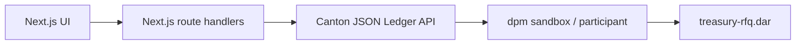
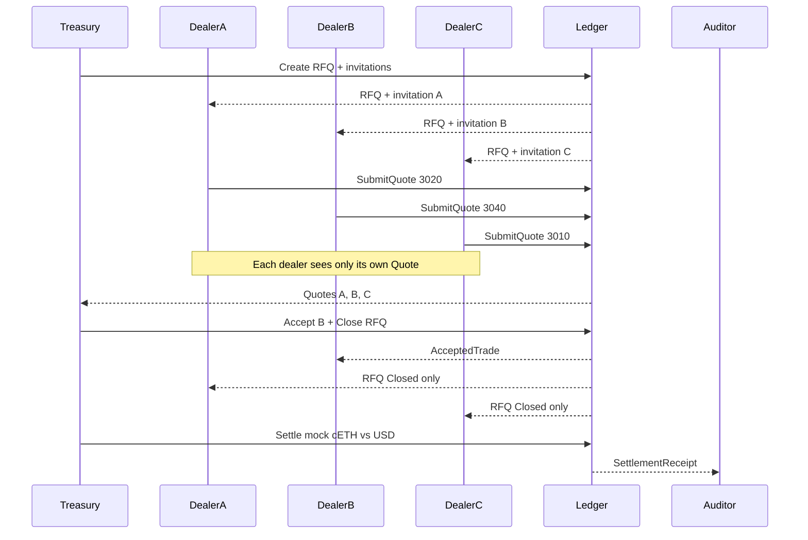
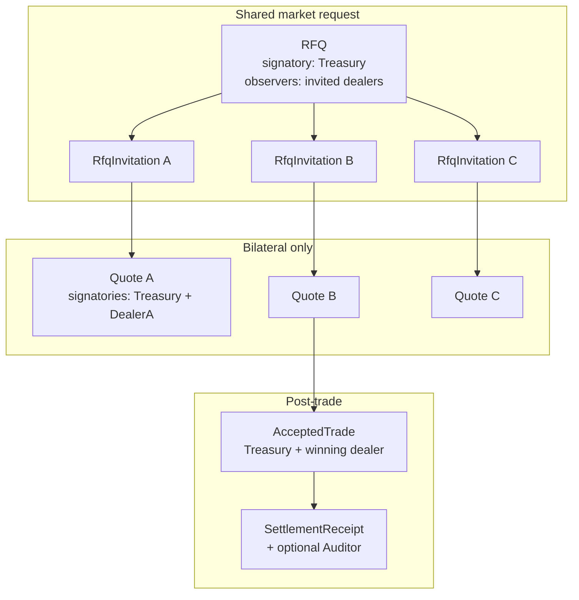

# Private Treasury RFQ

HackCanton Season 3 app: a corporate treasury requests quotes from multiple dealers on Canton, while each dealer sees only its own price.

## What an RFQ is

**RFQ** means Request for Quote. A buyer or seller publishes a trade they want done — asset, side (buy or sell), and size — and asks selected dealers to bid. Each dealer replies with a private price. The requester compares the quotes, picks one, and that pair settles. Competitors never see each other’s prices.

This is how corporate treasuries and institutional OTC desks trade. It is not an exchange order book and not an AMM.

Example demo flow:

1. Treasury posts **Sell 10 cETH**
2. Dealer A quotes `$3,020`, Dealer B `$3,040`, Dealer C `$3,010`
3. Treasury sees all three and accepts B (best bid on a sell)
4. Dealer A still cannot see B’s or C’s price
5. Treasury and Dealer B settle; an optional auditor sees only the final receipt

## Why Canton

On a public chain, every dealer quote is visible. On Canton, the treasury coordinates one RFQ while each quote is a **bilateral contract**.

> Canton lets multiple institutions coordinate on the same transaction workflow while each party sees only the data it is entitled to see.

Privacy comes from Daml signatories and observers on the ledger — not from filtering in the frontend.

## High-level architecture

Keep the stack thin. The ledger is the source of truth for RFQ, quote, trade, and settlement state.



| Layer | Role |
| --- | --- |
| Frontend | Role switcher (demo login), treasury / dealer / audit views |
| App API | Thin command/query proxy; acts as the selected party |
| Canton | Validates authorization and distributes contract data need-to-know |
| Daml DAR | RFQ lifecycle, bilateral quotes, settle, audit receipt |

No Kafka, Redis, PQS, or Kubernetes in the hackathon MVP.

## Workflow



## Contract model

Six templates. The important split: the **RFQ is shared**; each **Quote is bilateral**.



### Templates

| Template | Signatory | Observers | Purpose |
| --- | --- | --- | --- |
| `RFQ` | treasury | invited dealers | Shared market request (no prices) |
| `RfqInvitation` | treasury | that dealer only | Privacy-preserving factory for `SubmitQuote` |
| `Quote` | treasury + dealer | none | Private bilateral price |
| `AcceptedTrade` | treasury + dealer | none | Binding accepted terms |
| `TokenHolding` | issuer | owner | Mock CIP-56-shaped holding (`cETH` / `USD` / `CBTC`) |
| `SettlementReceipt` | treasury + dealer | optional auditor | Immutable post-trade evidence |

### Privacy-critical design rules

Do **not** put `SubmitQuote` or `Accept` on the shared `RFQ`. All invited dealers observe the RFQ. Choice arguments and nested consequences on that contract are visible to every observer ([Canton privacy model](https://docs.canton.network/appdev/deep-dives/privacy-model)).

- A price on `RFQ.SubmitQuote` would leak to competitors
- Fetching a `Quote` inside `RFQ.Accept` would **divulge** the winning quote to losing dealers
- Close the RFQ as a **sibling command** in the same submission as Accept
- Never pass price, dealer, or quote id into `CloseRFQ`
- `asset` and `quoteCurrency` are `Text`, not cETH-only enums, so CBTC can be added later without new templates

## Privacy model

| Party | Sees |
| --- | --- |
| Treasury | All RFQs, invitations, quotes, accepted trade, receipt |
| Dealer A (loser) | RFQ + own invitation + own quote; after close, closed RFQ only |
| Dealer B (winner) | RFQ + own quote + `AcceptedTrade` + receipt |
| Auditor | `SettlementReceipt` only — not competing pre-trade quotes |
| Stranger | Nothing |

Frontend renders whatever ACS the acting party can query. Competitor quotes must not be hidden only in the UI.

## Settlement

Happy path: **SELL 10 cETH**. Treasury delivers cETH; dealer pays `price * quantity` USD via mock `TokenHolding` transfers in one transaction.

`TokenHolding` lives in `Settlement.daml` so a later CIP-56 adapter (live [CBTC](https://docs.bitsafe.finance/developers/instrument-id-management) or [cETH](https://www.ceth.network/)) can replace transfers without rewriting RFQ/Quote. Both assets are CIP-56; they differ by registry, not by workflow. Live token integration is optional (P2).

## Track alignment

| Track | How this project maps |
| --- | --- |
| Financial Applications | Quote formation, economic choice (best bid/offer), asset flow, accept, settle |
| RWA & Business Workflows | Create RFQ → receive quotes → update state → accept → settle → audit receipt |

## Status

Daml packages are scaffolded on SDK **3.5.1**. Templates exist with the intended signatories and observers. Choices, privacy tests, sandbox API, and UI are still to be implemented (see Linear project tickets).

## Layout

- `daml/` — ledger contracts (`treasury-rfq`)
- `daml-test/` — Daml Script tests (`treasury-rfq-tests`)
- `frontend/` — not created yet

## Build

Requires [dpm](https://docs.canton.network/sdks-tools/cli-tools/dpm) and JDK 17+.

```bash
dpm build --all
dpm test --package-root daml-test
```

That test currently only checks that the test package imports the contract types.

## Demo script (target, under 3 minutes)

Once choices and UI land:

1. Split view: Treasury sees three quotes; Dealer A sees only `$3,020`
2. Treasury accepts Dealer B (`$3,040`, best bid)
3. Dealer A: RFQ closed, still no winning price
4. Dealer B: accepted trade visible
5. Settle mock cETH vs USD; Auditor sees receipt only
